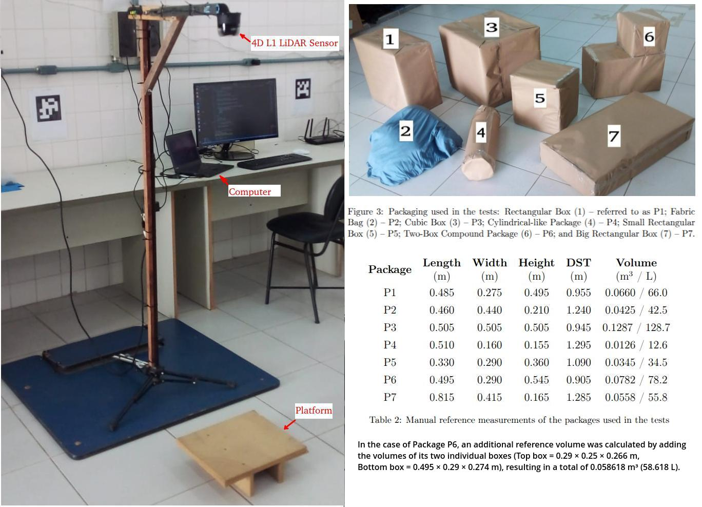
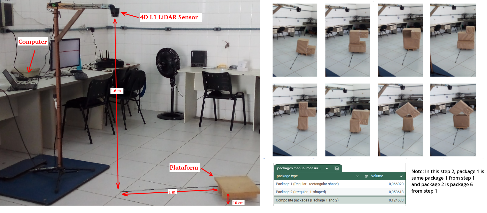

# Two-Stage 3D Volume Estimation from LiDAR Point Clouds
Repository with source code, experimental datasets, and ROS bag files for a volume estimation study using 3D point clouds from LiDAR. It features a comparative analysis of Bounding Box, Convex Hull, and Voxelization, plus an automatic voxel-based algorithm for complex geometries and partial occlusions.

---

## 🏗 System Architecture

The system is composed of a processing unit and a 3D LiDAR sensor device:

| Hardware                 | OS           | ROS 2   | Responsibility                          |
|--------------------------|--------------|---------|-----------------------------------------|
| PC (Vision processing)   | Ubuntu 20.04 | Foxy    | LiDAR PointCloud Processing (Open3D)    |
|  4D LiDAR L1 (sensor)    |   Driver     | Foxy    | Point cloud acquisition (Unilidar_SDK)  |              |


---

## 🛠 Prerequisites & Installation

1. **Vision & Processing (PC 1)**
   - Install [Ubuntu 20.04](https://www.releases.ubuntu.com/focal/)
   - Install [ROS2 Foxy](https://docs.ros.org/en/foxy/Installation.html)
   - Install Unitree [LiDAR SDK ROS2](https://github.com/unitreerobotics/unilidar_sdk/blob/main/unitree_lidar_ros2/src/unitree_lidar_ros2/README.md)
   - Download the folders "*Comparisom_Three_Methods*" and "*Automatic_Volume_Estimation*" from this repository
   - Install Open3D: `pip3 install open3d`.
   - Connect via Serial-to-USB to the 4D LiDAR L1.
  
2. **Platform of tests**
   - If you wish to *compare the three volume estimation methods*, prepare the testing platform according to the image of the experimental environment in step 1. Also prepare the packages whose volumes are to be measured, as described in the article and shown in the image with the test packages from step 1.
     
   - **Image of Experimental Enviroment stage 1 and the packages used in tests**

    
   
   - If you wish to *test the automatic volume estimation script*, prepare the test platform according to the image of the experimental environment in step 2. Also prepare the packages whose volumes are to be measured, as described in the article and shown in the image with the test packages from step 2.
     
   - **Image of Experimental Enviroment stage 2 and the packages used in tests**

    

---

## 🚀 Execution Sequence

To ensure the handshakes between nodes occur correctly, follow this specific launch order.  
**Note:** Every terminal must have the ROS 2 environment sourced (`source /opt/ros/foxy/setup.bash`) and export ROS_DOMAIN_ID=0. For more information, read the article to which this repository is linked.

 ### If you want to compare the three volume estimation methods, as in step 1 of the article, follow the steps below:
  - Connect the 4D LiDAR L1 sensor via USB. In a Terminal run lidar driver node ROS2:
    ```
    cd unilidar_sdk/unitree_lidar_ros2/
    source install/setup.bash
    ros2 launch unitree_lidar_ros2 launch.py
    ```
  
  - Place the box to be measured on the platform under the sensor. In another Terminal, run the volume estimation script that activates the ROS2 node for point cloud processing:
    ```
    cd Comparisom_Three_Methods
    python3 VolumeEstimationBoundingBox.py
    ```
  - or
    ```
    python3 VolumeEstimationConvexHull.py
    ```
  - or
    ```
    python3 VolumeEstimationVoxelization.py    
    ```
  ### If you want to estimate the volume automatically, as in step 2 of the article, do the following:
   - Connect the 4D LiDAR L1 sensor via USB. In a Terminal run lidar driver node ROS2:
      ```
      cd unilidar_sdk/unitree_lidar_ros2/
      source install/setup.bash
      ros2 launch unitree_lidar_ros2 launch.py
      ```
   - Place the box to be measured on the platform under the sensor. In another Terminal, run the volume estimation script that activates the ROS2 node for point cloud processing:
      ```
      cd Automatic_Volume_Estimation
      python3 automaticVolumeEstimationVoxelization_Hibrid.py
      ```
---
## 🔄 Communication Flow (The "Handshake")

- LiDAR captures the point cloud, processes and sends data to `/unilidar_cloud`.  
- The script that activates the ROS2 node for point cloud processing, receives the sensor data and estimates the volume according to the method implemented in the chosen script.

---

## 📝 Authors

- **Luciano Gonçalves Moreira** - luciano.goncalves@ufv.br (UFV / IF Sudeste MG)  
- **Alexandre Santos Brandão** - Alexandre.brandao@ufv.br (UFV)
